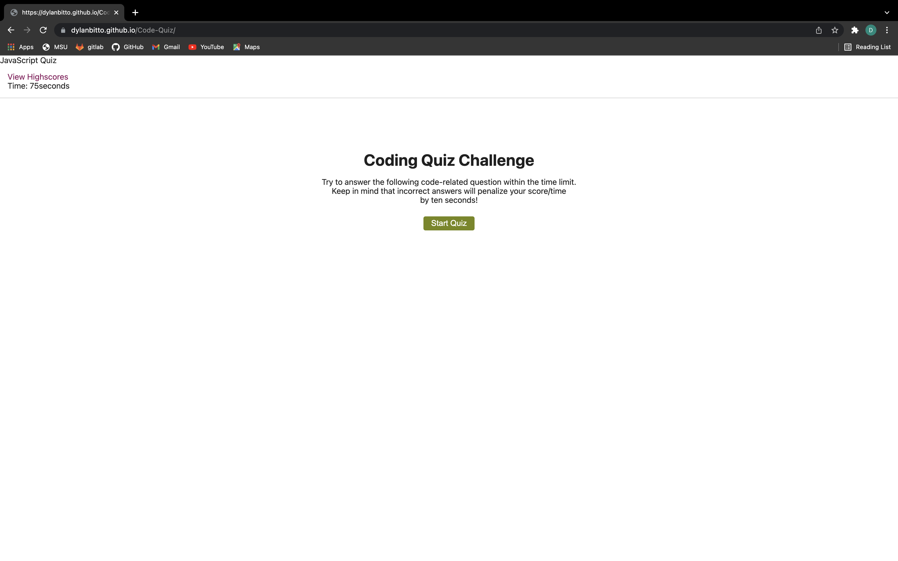

## Purpose
to create a timed javascript quiz where you can save your scores afterwards by using initials

## Description
* The quiz is made up of 5 questions
* You have 75 seconds to complete the quiz
* Everytime you answer incorrectly 10 seconds are deducted from the timer

## Built With
* html
* css
* javascript

## Website
https://dylanbitto.github.io/Code-Quiz/

